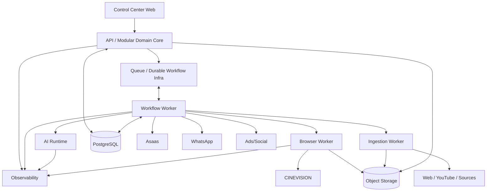

# C4 — Container Architecture

> Status: Draft auto-revisado  
> Versão: 1.0  
> Data: 2026-09-20

## 1. Containers lógicos

“Container” aqui segue C4: unidade executável/deployável ou data store significativo, não Docker obrigatoriamente.

## 2. Control Center Web

**Responsabilidade**

- UI do tenant;
- inbox;
- CRM;
- dashboards;
- HITL;
- configuração;
- audit views;
- SaaS admin surfaces quando autorizado.

**Não faz**

- regras críticas;
- decisão financeira;
- direct provider state mutation sem API.

## 3. API / Domain Core

**Recomendação MVP**: modular monolith.

Responsável por:

- auth context/RBAC;
- domain services;
- state machines;
- invariants;
- Orders/Billing canonical state;
- Entitlements;
- ledgers;
- event persistence/outbox;
- queries para UI;
- Policy decisions determinísticas.

## 4. Workflow Worker

Responsável por:

- jobs assíncronos;
- durable workflows;
- retries;
- follow-ups;
- reconciliation;
- provider operation orchestration;
- notification scheduling;
- long waits.

Pode compartilhar código de domínio sem compartilhar estado em memória.

## 5. AI Runtime

Pode iniciar como módulo/processo do Worker/API e ser extraído posteriormente.

Responsável por:

- context builder;
- model routing;
- retrieval;
- agent reasoning;
- tool request generation;
- eval/trace hooks.

Tool authorization permanece fora do modelo.

## 6. Browser Worker

Processo isolado.

Responsável por:

- browser session;
- provider UI actions;
- traces/screenshots;
- postcondition checks;
- UI drift detection.

Não recebe acesso irrestrito a todo database; usa contratos necessários.

## 7. Ingestion Worker

Pode iniciar dentro de Workflow Worker.

Responsável por:

- `yt-dlp`;
- transcript processing;
- documents;
- groups/webhook ingestion;
- content normalization;
- candidate knowledge creation.

External content permanece untrusted até validação.

## 8. PostgreSQL

Fonte de verdade principal.

Contém:

- domain state;
- tenant/control-plane data;
- ledgers;
- outbox/inbox;
- workflow metadata quando tecnologia escolhida utilizar DB próprio/compartilhado apropriadamente;
- analytics operational projections quando adequado.

## 9. Object Storage

Armazena blobs grandes:

- media;
- attachments;
- transcripts/raw source snapshots;
- browser traces;
- screenshots;
- generated creatives.

Database guarda metadata/references, não blobs desnecessários.

## 10. Queue / Durable Workflow Infrastructure

Abstração lógica para:

- delayed work;
- retries;
- durable timers;
- workflow signals;
- consumer isolation.

Tecnologia a decidir em SPEC/ADR posterior.

## 11. Observability

Responsável por:

- logs;
- metrics;
- traces;
- LLM traces/evals;
- alerting;
- SLO evidence.

Audit Log de negócio continua no Domain Core; observability não o substitui.

## 12. Integration Adapters

Contratos próprios para:

- Cinevision;
- Asaas;
- WhatsApp;
- Ads;
- App Suppliers;
- social publishing;
- web/knowledge sources.

## 13. Diagrama

## 14. Auto-revisão aplicada

Revisado para:

- separar Audit de Observability;
- não obrigar AI Runtime a ser microservice;
- não obrigar Ingestion a processo próprio no MVP;
- isolar Browser Worker;
- manter PostgreSQL como state authority;
- evitar acesso direto Web → providers.
