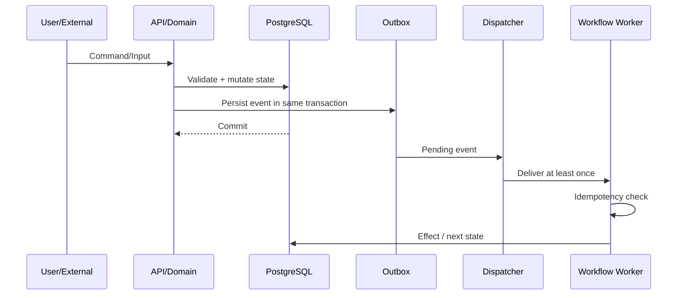

# Event & Workflow Architecture

> Status: Draft auto-revisado  
> Versão: 1.0  
> Data: 2026-09-20

## 1. Objetivo

Garantir comunicação desacoplada e workflows recuperáveis sem prometer “exactly once delivery”.

## 2. Delivery model

Assumir:

```text
At-least-once delivery
+
Idempotent consumers
+
Business idempotency keys
=
Exactly-once business effect quando possível
```

Duplicidade de entrega é normal; duplicate financial/fulfillment effects não são.

## 3. Flow



## 4. Commands

Commands express intent and may fail:

```text
CreateTrial
SettleOrder
RenewSubscription
GrantReward
RequestProviderOperation
```

Commands should carry idempotency key when caller may retry.

## 5. Events

Events represent facts already persisted.

Semantics governed by `docs/02-domain/event-model.md`.

## 6. External events

External webhook/message never directly mutates business state without validation.

```text
Receive
↓
Verify/authenticate
↓
Deduplicate Inbox
↓
Normalize
↓
Domain Command/Decision
↓
Canonical Event
```

## 7. Durable workflows

Examples:

### Trial

```text
trial.activated
↓ timer
follow-up
↓ wait
technical outcome / expiry
```

### Renewal

```text
renewal_due
↓
charge / communication
↓
payment paid
↓
settle order
↓
entitlements
↓
provider fulfillment
```

### HITL

```text
review_requested
↓
wait for human signal
↓
resume workflow
```

## 8. Retry policy

Retry only errors classified transient.

Need categories:

```text
TRANSIENT
PERMANENT
HUMAN_REQUIRED
POLICY_DENIED
CONFLICT
```

Backoff and maximum attempts vary by operation.

## 9. Compensation

Compensation does not mean “undo everything”.

Examples:

- Payment confirmed + provider unavailable → keep entitlement/fulfillment pending, not refund automatically.
- Reward ledger posting erroneous → reversal entry, not delete original.
- Provider action succeeded but local ack lost → reconciliation before repeating destructive action.

## 10. Reconciliation

Reconciliation is a first-class workflow, not a retry substitute.

Detects unknown success/failure and state drift after the original transaction window.

## 11. Dead letter

After retry budget exhausted:

```text
Dead Letter / Failed Workflow
↓
Operator visibility
↓
HITL / repair / replay
```

Replay must use same business idempotency keys when representing same intent.

## 12. Correlation

Use:

- `correlation_id` for end-to-end workflow/business journey;
- `causation_id` for immediate causal event;
- `aggregate_version` for per-aggregate ordering/concurrency.

## 13. Event versioning

Consumers declare supported versions.

No consumer should silently reinterpret event semantics after schema evolution.

## 14. N8n boundary

n8n may consume/trigger integration workflows, but critical state transition remains canonical in Domain Core.

If n8n is unavailable, authoritative state must remain recoverable.

## 15. Auto-revisão aplicada

Revisado para:

- não prometer exactly-once transport;
- separar retry de reconciliation;
- evitar compensação financeira destrutiva;
- manter webhook externo fora do domain state até validação;
- manter workflow state durável.
