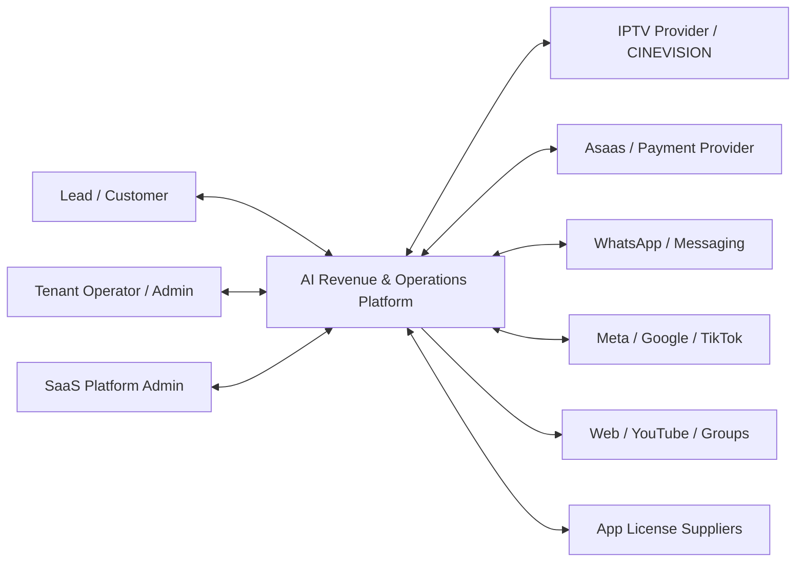

# C4 — System Context

> Status: Draft auto-revisado  
> Versão: 1.0  
> Data: 2026-09-20

## 1. Sistema em foco

**AI Revenue & Operations Platform**

Sistema SaaS multi-tenant responsável por centralizar operação comercial, CRM, trials, assinaturas, billing, provider fulfillment, suporte, knowledge, referral, growth e automação assistida por IA.

## 2. Pessoas

### Lead / Customer

Interage por WhatsApp, redes sociais, landing page e outros canais para:

- conhecer o serviço;
- solicitar Trial;
- comprar;
- receber suporte;
- renovar;
- usar referral/rewards.

### Tenant Operator / Admin

Opera um negócio dentro do SaaS.

Responsável por:

- revisar CRM;
- acompanhar métricas;
- intervir via HITL;
- configurar produtos/policies;
- acompanhar financeiro/provider;
- assumir conversas.

### Tenant Support / Commercial User

Usuário operacional com RBAC limitado.

### SaaS Platform Admin

Opera o próprio produto SaaS:

- tenants;
- features;
- limits;
- health;
- support;
- platform operations.

## 3. Sistemas externos

### IPTV Provider — CINEVISION

Executa fulfillment externo:

- Trial;
- ativação;
- renovação;
- conexões;
- migração;
- bloqueio;
- demais provider operations.

Não é fonte de verdade comercial.

### Payment Provider — Asaas

Executa cobrança/pagamento e envia eventos externos que são reconciliados internamente.

### Messaging Provider — WhatsApp API não oficial inicialmente

Transporta mensagens. Pode ser substituído.

### Social / Ads Platforms

Meta, Google, TikTok e canais futuros para aquisição, publishing e performance.

### Web / YouTube / Knowledge Sources

Fontes externas não confiáveis por padrão; conteúdo entra em quarantine antes de virar Knowledge VERIFIED.

### App License Suppliers

Fornecem licenças premium revendidas ou concedidas como Reward.

## 4. Diagrama

## 5. Boundaries

Dentro do sistema:

- canonical identity;
- CRM;
- business state;
- Orders;
- Entitlements;
- ledgers;
- Agent policies;
- analytics definitions;
- audit.

Fora:

- execution state particular de provider/gateway/channel;
- conteúdo externo;
- Ads platform reporting.

External state é observado/reconciliado, não adotado como autoridade automática.

## 6. Auto-revisão aplicada

Revisado para:

- não representar CINEVISION como subsystem interno;
- separar tenant operator de SaaS admin;
- incluir app suppliers e knowledge sources;
- manter channel/payment/provider substituíveis.
