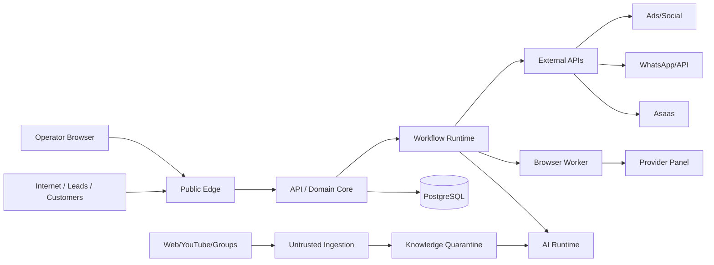

# Threat Model

> Status: Draft auto-revisado  
> Versão: 1.0  
> Data: 2026-09-20  
> Escopo: plataforma SaaS, tenant runtime, agentes, integrations e Browser Worker.

## 1. Objetivo

Identificar ativos, trust boundaries, ameaças e controles mínimos antes de transformar o desenho lógico em implementação. Este documento não substitui testes de segurança, revisão jurídica ou runbooks de incidentes.

## 2. Ativos críticos

### A1 — Identidade e dados de clientes

- nomes e contatos;
- identities de canais;
- conversas;
- histórico comercial/suporte;
- device/network context quando coletado.

### A2 — Estado comercial

- Leads;
- Orders;
- Payments internos;
- Subscriptions;
- Entitlements;
- Rewards;
- Referral Wallet.

### A3 — Ativos financeiros

- Financial Ledger;
- Provider Credit Ledger;
- preço/custo snapshots;
- reconciliações;
- refunds/chargebacks.

### A4 — Credenciais e sessões

- Asaas API keys;
- WhatsApp credentials/session;
- Cinevision credentials/browser sessions;
- Ads tokens;
- social credentials;
- secrets de infraestrutura.

### A5 — Autoridade do agente

- prompts/policies;
- tool permissions;
- autonomy settings;
- HITL approvals;
- Agent Releases.

### A6 — Conhecimento

- Knowledge Items verificados;
- fontes externas;
- transcripts;
- procedimentos;
- rankings de solução.

### A7 — Multi-tenant boundary

- tenant data;
- tenant configurations;
- secrets;
- usage/billing;
- object storage paths.

### A8 — Provider operations

- Browser traces;
- Provider Bindings;
- provision/renew/migrate/block actions;
- reconciliation.

## 3. Trust boundaries



Principais fronteiras:

1. Internet → Public Edge;
2. Tenant User → Tenant Resources;
3. SaaS Admin → Tenant Runtime;
4. API → Database;
5. AI Runtime → Tools;
6. Workflow → External APIs;
7. Browser Worker → privileged provider session;
8. External content → Knowledge;
9. Webhook payload → canonical domain state;
10. one tenant → another tenant.

## 4. Método

Usamos categorias STRIDE como checklist, complementadas por riscos agentic/business abuse.

- **S**poofing;
- **T**ampering;
- **R**epudiation;
- **I**nformation Disclosure;
- **D**enial of Service;
- **E**levation of Privilege.

Riscos agentic adicionais:

- prompt/goal hijacking;
- tool misuse;
- memory/knowledge poisoning;
- over-permissioned agent;
- cascading automation failures.

## 5. Threat register prioritário

| ID | Ameaça | Impacto | Prob. | Prioridade | Controles principais |
|---|---|---:|---:|---:|---|
| T01 | Cross-tenant data access/BOLA | crítico | média | P0 | tenant context, resource auth, RLS/DB guards, tests |
| T02 | Agent executa ação indevida após prompt injection | crítico | alta | P0 | Policy Engine, tool allowlist, risk classes, HITL |
| T03 | Secret exposto em prompt/log/trace | crítico | média | P0 | secret manager, redaction, scoped identities |
| T04 | Webhook duplicado gera dupla renovação/reward | alto | alta | P0 | inbox/dedupe, idempotency, ledger constraints |
| T05 | Provider operation executa duas vezes após timeout | alto | alta | P0 | operation key, verify-before-retry, postconditions |
| T06 | Knowledge poisoning altera comportamento | alto | média | P0 | quarantine, provenance, validation, instruction/data separation |
| T07 | Browser session de tenant usada por outro | crítico | baixa/média | P0 | profile isolation, secret refs, worker authorization |
| T08 | Admin interno excede função | alto | média | P0 | granular RBAC, audit, JIT/high-risk approval |
| T09 | Trial/referral/coupon abuse | médio/alto | alta | P1 | Risk Engine, eligibility, graph checks, review |
| T10 | WhatsApp/API não oficial indisponível/ban | alto operacional | média/alta | P1 | adapter, health, queue, channel fallback, kill switch |
| T11 | Financial ledger adulterado | crítico | baixa | P0 | append-only policy, reversals, DB permission separation, audit |
| T12 | PII em analytics/event payload desnecessariamente | alto | média | P1 | event minimization, classification, schema review |
| T13 | Mass outbound spam por bug/agente | alto | média | P1 | frequency cap, budgets, rate limit, kill switch |
| T14 | Browser UI drift causa ação no cliente errado | alto | média | P0 | semantic selectors, pre/postconditions, safe account validation |
| T15 | Account takeover de operador | alto | média | P0 | MFA, session controls, anomaly detection, least privilege |
| T16 | SSRF/arbitrary navigation via Browser Worker | crítico | baixa/média | P0 | allowlisted provider origins, network policy, no raw URL tool |
| T17 | Malicious attachment/transcript | alto | média | P1 | file limits, quarantine, content-type validation, sandboxed processing |
| T18 | Storage object enumeration across tenants | alto | média | P0 | tenant prefixes, signed access, backend authorization |
| T19 | Data deletion removes financial/audit evidence improperly | alto | média | P1 | retention policy, anonymization, legal/financial exemptions |
| T20 | Metrics manipulation causes bad automated decisions | alto | média | P1 | Tracking Plan, metric contracts, anomaly detection, human approval |

## 6. Cross-tenant isolation

### Invariants

- todo request autenticado recebe `tenant_context` resolvido no servidor;
- `tenant_id` do payload nunca é autoridade por si só;
- resource queries incluem tenant scope;
- background jobs carregam tenant scope assinado/validado;
- object storage usa tenant namespace + authorization;
- cache keys possuem tenant namespace;
- search/vector retrieval sempre filtra tenant;
- browser profiles nunca são compartilhados entre tenants.

### Testes obrigatórios

- negative authorization tests em toda rota com resource ID;
- fuzz de IDs de outro tenant;
- job replay em tenant errado;
- vector/search isolation tests;
- signed URL boundary tests.

## 7. Agent & tool security

### Regra

LLM é **untrusted decision proposer**, não security principal.

```text
Agent output
↓
Tool Request Schema Validation
↓
Policy Engine
↓
Tenant + Permission
↓
Action Risk
↓
Business Preconditions
↓
Approval/HITL quando necessário
↓
Tool execution
```

### O agente nunca recebe

- raw API secrets;
- DB superuser credentials;
- unrestricted browser navigation;
- arbitrary SQL execution em produção;
- capability de alterar policy própria;
- capacidade de aprovar a própria ação R3/R4.

## 8. Prompt injection e knowledge poisoning

Toda fonte externa entra como `UNTRUSTED`.

O ingestion pipeline deve:

1. preservar provenance;
2. classificar conteúdo;
3. extrair fatos/candidatos;
4. remover/neutralizar instruções operacionais não autorizadas;
5. validar antes de promover para Knowledge verificado.

Retrieval deve marcar conteúdo como **data**, nunca como system/tool instruction.

## 9. Financial integrity

### Invariants

- ledger entries não são editados; correções usam reversal/adjustment;
- valores monetários usam inteiro na menor unidade ou tipo decimal definido;
- currency é explícita;
- Order usa PriceSnapshot;
- reward/referral credit tem ledger próprio;
- settlement é idempotente;
- provider cost recurring é registrado por ciclo aplicável;
- conexão adicional nunca vira custo único por acidente.

### High-risk actions

- refund;
- manual ledger adjustment;
- credit inventory adjustment;
- free renewal;
- large coupon override;
- ad budget change relevante.

Todas exigem reason + audit; algumas exigem dual approval configurável.

## 10. Browser Worker security

### Controles

- allowlist de domains/origins por Provider Adapter;
- nenhuma tool `navigate(url)` exposta ao agente;
- isolated persistent profile por provider account/tenant;
- credentials recuperadas por secret reference;
- traces protegidos e com retenção menor quando contêm PII;
- downloads tratados como untrusted;
- postcondition obrigatória para mutações;
- CAPTCHA/2FA/security challenge → HITL;
- UI drift relevante → adapter degraded/kill switch.

## 11. Webhook security

Fluxo:

```text
Webhook
↓
size/rate limit
↓
signature/auth quando disponível
↓
schema validation
↓
external event inbox
↓
dedupe
↓
canonical mapping
↓
domain command/event
```

Nunca deixar webhook alterar diretamente tabelas financeiras ou subscriptions sem Domain Core.

## 12. API não oficial de WhatsApp

Risco operacional é maior que um provider oficial.

Controles adicionais:

- adapter substituível;
- session health;
- reconnect counters;
- delivery/failure telemetry;
- queue preservada durante outage;
- outbound rate/frequency policy;
- kill switch por sessão/tenant;
- não acoplar identity canonical ao ID interno do provider.

## 13. Availability / abuse

Controles mínimos:

- rate limit por IP/tenant/identity/endpoint;
- quotas por tenant;
- limits para upload/transcription;
- bounded tool loops;
- maximum agent/tool budget;
- workflow concurrency limits;
- circuit breaker em provider instável;
- queue backpressure;
- cost anomaly alerts.

## 14. Audit & repudiation

Audit record deve capturar:

- actor;
- tenant;
- action;
- target;
- before/after quando necessário;
- reason;
- correlation_id;
- source: human/agent/workflow/external;
- Agent Release/Policy version quando aplicável.

Debug logs não substituem Audit Log.

## 15. Security acceptance gates do MVP

Antes de produção real:

- [ ] cross-tenant authorization tests;
- [ ] MFA para roles administrativas de maior privilégio;
- [ ] secret manager em produção;
- [ ] webhook idempotency tests;
- [ ] ledger double-processing tests;
- [ ] prompt injection/tool misuse eval set;
- [ ] Browser Worker origin allowlist;
- [ ] trace/log redaction;
- [ ] backup + restore test;
- [ ] kill switches testados;
- [ ] incident response contacts/runbook básico;
- [ ] privacy/export/deletion workflow definido.

## 16. Auto-revisão aplicada

Revisado para:

- incluir ameaças específicas de agentes;
- tratar Browser Worker como privileged execution boundary;
- incluir abuso econômico, não só segurança técnica;
- considerar API não oficial de WhatsApp como risco operacional;
- proteger multi-tenancy em jobs/storage/search além do HTTP;
- preservar integrity de ledger e recurring add-ons;
- distinguir auditabilidade de observability.
